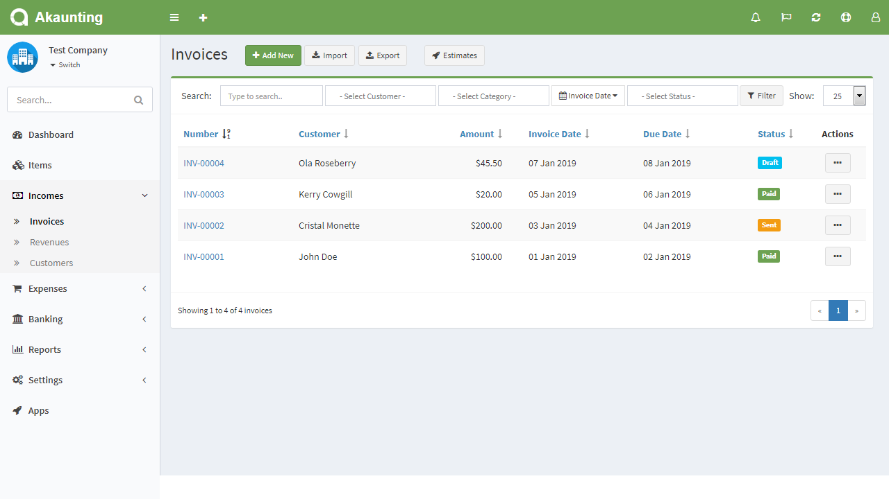
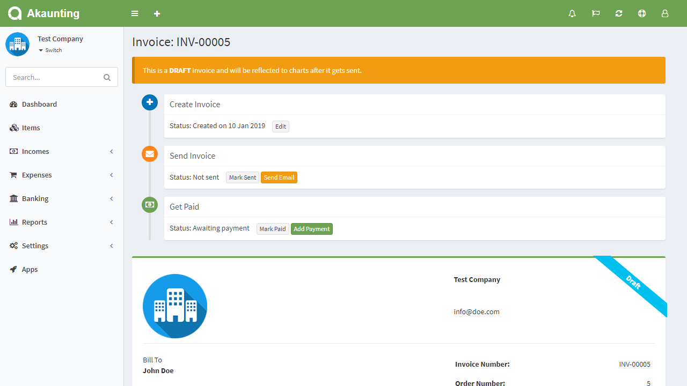

Invoices
========

Invoices page is located under **Incomes > Invoices** menu. On this page you can see all invoices, search/filter for any, create a new one, edit the current ones and delete them.

The following fields are displayed:

- **Number**: The number assigned to the invoice.
- **Customer**: Who will pay the invoice.
- **Amount**: Amount of the invoice.
- **Invoice Date**: Date when the invoice is issued.
- **Due Date**: Date when the invoice is due to be paid.
- **Status**: The status of the invoice.
- **Actions**: You can use this button to show, edit, duplicate, and delete the invoice.

## New Invoice

The following fields are displayed as blank to be filled, some are required and some not. Those marked with red star are required.

- **Customer**: Who will pay the invoice.
- **Currency**: Currency used.
- **Invoice Date**: Date when the invoice is issued.
- **Due Date**: Date when the invoice is due to be paid.
- **Invoice Number**: The number assigned to the invoice.
- **Order Number**: A number assigned to an order for that invoice.
- **Items**: The list of all items that can be assigned to that invoice. You can add multiple items.
	- **Actions**: There are 2 (two) actions; Add and Delete.
	- **Name**: The name of item. It will populate records from *Items* page after you start typing their name. It can also be a custom item.
	- **Quantity**: Default is 1. You can enter decimal quantity (1.7)
	- **Price**: The sale price of item. It will bring it automatically but you have the opportunity to change it if you want.
	- **Tax**: The list of applicable Tax Rates. You can select multiple taxes. See the *Settings > Tax Rates* documentation for more details.
	- **Total**: It will calculate automatically the total price of item according the quantity and tax. It is not an editable field.
	- **Subtotal**: The total prices of items without taxes.
	- **Tax**: The total price of taxes.
	- **Total**: The final amount of invoice, including everything.
- **Notes**: You can add a custom note to the invoice.
- **Category**: Category of the invoice to be used in reports.
- **Recurring**: Automatically create invoices for ongoing jobs. Times=0 means infinite. Don't forget to set the *Cron Command* available at *Settings > General > [Scheduling](https://akaunting.com/docs/user-manual/settings/general)*.
- **Attachment**: You can attach file related to the invoice.

## Show Invoice

The following image shows the details page of an invoice:

### Share

The share button gives you a unique invoice link so you could send it to your customer and allow them to pay the invoice without having to login.

### Actions

From the left bottom buttons, you can edit, print, delete, add payment, send invoice via email and apply a lot more actions.
