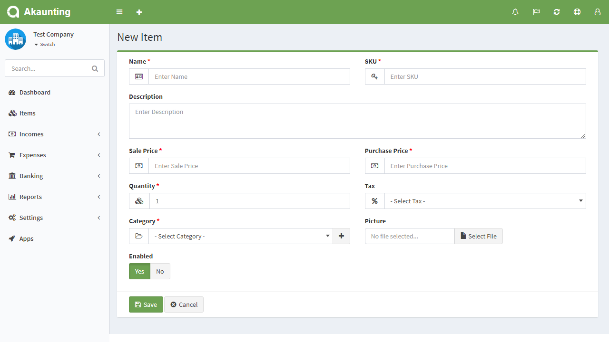

Items
=====

On this page you can see all items, search for any, create a new one, edit the current ones and delete them. Items can be products or services. You can use items when creating invoices and bills to have the price, tax etc fields populated.

The following fields are displayed:

- **Picture**: Item's picture.
- **Name**: Item's name.
- **Category**: Category of item, if applicable.
- **Quantity**: How many items are available. This is usefull for stock management. Quantity gets descreased whenever an invoice is created and increased when a bill is created.
- **Sale Price**: This price will be populated in invoices.
- **Purchase Price**: This price will be populated in bills.
- **Status**: Disabled items don't get populated when creating invoices/bills.
- **Actions**: You can use this button to edit, duplicate, and delete the item.

## New Item

The following details are displayed as blank to be filled, some are required and some not. Those who are marked with red star are required fields.

- **Name**: Item's name.
- **SKU**: Item's sku. SKU is a unique field.
- **Description**: Item's description, if applicable.
- **Sale Price**: This price will be populated in invoices.
- **Purchase Price**: This price will be populated in bills.
- **Quantity**: How many items are available. This is usefull for stock management. Quantity gets descreased whenever an invoice is created and increased when a bill is created.
- **Tax**: Tax of item, if applicable. It will be populated when creating invoices/bills.
- **Category**: Category of item, if applicable.
- **Picture**: Item's picture.
- **Status**: Disabled items don't get populated when creating invoices/bills.

